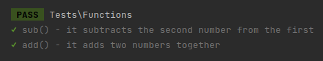
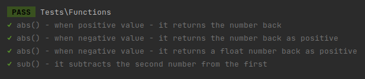

> [!WARNING]
> **DEPRECATED**: Pest has official support for describe blocks now
> 
> https://pestphp.com/docs/pest-spicy-summer-release#content-describe-blocks

# Nest - Visually group your Pest tests

Nest is a plugin for [PestPHP](https://pestphp.com/) to allow visual separation in your test files and test output

## Installation

For pest 2.0 you should make sure you are on ^1.0

```shell
composer require ozzie/pest-plugin-nest --dev
```

For pest 1.0 you should make sure you are on ^0.1

```shell
composer require ozzie/pest-plugin-nest "^0.1" --dev
```

## Usage

> **Note**
> While these functions forward their api to the native Pest `test`/`it` functions, you must use the Nest namespaced functions in order for the reporting to properly display. 

```php
use function Ozzie\Nest\describe;
use function Ozzie\Nest\it;

describe('sub()', function() {
  it('subtracts the second number from the first')
    ->expect(Calc::sub(10, 5))
    ->toEqual(5);
});

describe('add()', function() {
  it('adds two numbers together')
    ->expect(Calc::add(1, 2))
    ->toEqual(3);
});
```

Produces:



You can also nest multiple describe blocks and optionally use the `when()` block as an alternative to `describe()` 

```php
use function Ozzie\Nest\describe;
use function Ozzie\Nest\when;
use function Ozzie\Nest\it;

describe('abs()', function () {
  when('positive value', function() {
    it('returns the number back', function () {
      expect(Calc::abs(1))->toEqual(1);
    });
  });
  
  when('negative value', function() {
    it('returns the number back as positive', function () {
      expect(Calc::abs(-1))->toEqual(1);
    });
    it('returns a float number back as positive', function () {
      expect(Calc::abs(-1.5))->toEqual(1.5);
    });
  });
});

describe('sub()', function() {
  it('subtracts the second number from the first')
    ->expect(Calc::sub(10, 5))
    ->toEqual(5);
});
```

Produces:



You can also call the class directly if you prefer

```php
use Ozzie\Nest\Nest;

Nest::describe('sub()', function() {
  Nest::it('subtracts the second number from the first')
    ->expect(Calc::sub(10, 5))
    ->toEqual(5);
});

Nest::describe('add()', function() {
  Nest::it('adds two numbers together')
    ->expect(Calc::add(1, 2))
    ->toEqual(3);
});
```

## API

### test / it

These functions operate exactly the same as the Pest provided ones (as they forward their calls there under the hood). We need to use these functions though so that we can properly modify the test name in the output

```php
use function Ozzie\Nest\test;
use function Ozzie\Nest\it;

test('true is true')->expect(true)->toEqual(true);

it('is true')->expect(true)->toEqual(true);

// normal callbacks work as well
it('can do math', function() {
  expect(1 + 1)->toEqual(2);
});
```

### describe / when

These functions are purely for grouping your `test`/`it` calls together

`describe()` will prefix all the nested tests with its description

`when()` will prefix all the nested tests with `when ` + its description

These functions can be nested as many times as you need

```php
use function Ozzie\Nest\describe;
use function Ozzie\Nest\when;
use function Ozzie\Nest\it;

describe('abs()', function () {
  when('positive value', function() {
    it('returns the number back', function () {
      expect(Calc::abs(1))->toEqual(1);
    });
  });
  
  when('negative value', function() {
    it('returns the number back as positive', function () {
      expect(Calc::abs(-1))->toEqual(1);
    });
    it('returns a float number back as positive', function () {
      expect(Calc::abs(-1.5))->toEqual(1.5);
    });
  });
});
```

## Limitations

Unfortunately due to how the setup/teardown functions work you cannot nest them within `describe`/`when` blocks and have them only apply to that block. You still must only have one e.g. `beforeEach` call in the entire file which applies to every test.

You must also explicitly use the `Ozze\Nest\test` and `Ozze\Nest\it` functions when using `describe` or `when` so that we can properly update the test output.
